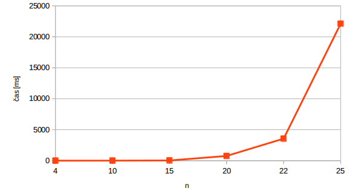
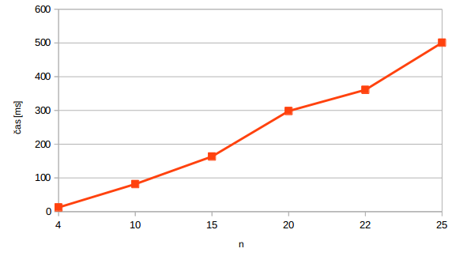
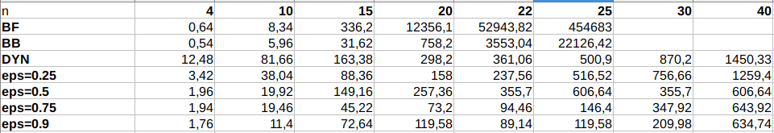
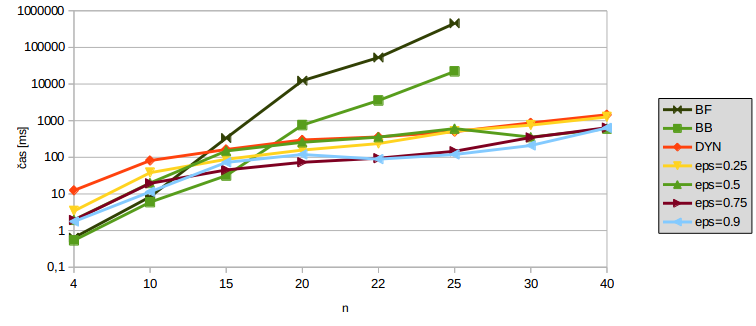
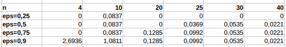
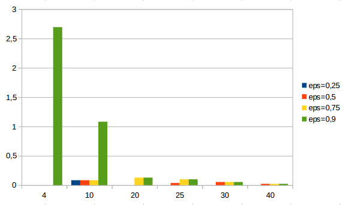
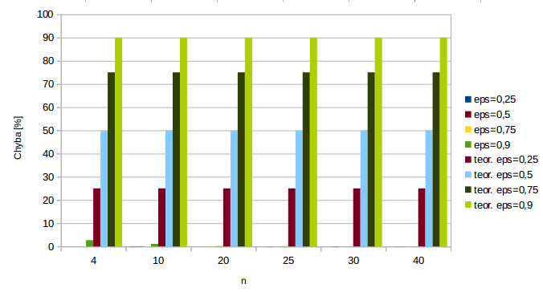

## MI-PAA: Řešení problému batohu dynamickým programováním, metodou větví a hranic a aproximativním algoritmem

### Specifikace úlohy
Viz [edux](https://edux.fit.cvut.cz/courses/MI-PAA/tutorials/batoh).

### Rozbor možných variant řešení

##### Metodou větví a hranic (B&B)

Metoda je velmi podobná řešení hrubou silou. Jediný rozdíl se nachází v hloubce rekurze. V každém kroku zkontrolujeme zdali má smysl jít hlouběji. To určuje metoda `isPerspective()`, která v současném kroku rekurze spočítá co se stane, pokud přidáme všechny ostatní položky nehledě na kapacitu. Pokud je celková cena přesto nižší než současné řešení, další rekurzi nevytváříme.

##### Metoda dynamického programování

Nejprve vytvoříme sumu cen položek. Poté inicializujeme tabulku položek od 1 do této maximální ceny. Tabulku vyplníme postupně rekurzí - řešíme problémy E(n, c) pro všechna c a rekurzivně potřebné podproblémy.

Označme E(i, c) instanci 0/1 inverzního problému batohu se zadanou cenou c, která vznikne z řešené instance omezením na prvých i věcí. Označme dále W(i, c) sumární hmotnost věcí řešené instance. Pak platí:

- W(0,0) = 0
- W(0,c) = ∞ pro všechna c > 0
- W(i+1, c) = min(W(i, c), W(i, c-ci+1)+wi+1) pro všechna i > 0.

Z výsledných řešení W(n, c) vybereme řešení, pro které je W(n, c) < M pro největší c.

##### Metodou FPTAS

Pomocí vzorce `floor(log((eps * Cm / n)))` spočteme *b*. Toto *b* určuje o kolik bitově posuneme každou z cen. Poté zavoláme metodu dynamického programování. Získáme výsledky a aplikujeme je na původní ceny.

### Popis kostry algoritmu

Soubor `main.php` obsahuje prvotní logiku programu. Vytvoří třídu Runner. Ta načte data ze souboru a řádek po řádku vytváří instanci třídy `RuckSackProblemBB` (apod.). Tyto třídy jsou potomky abstraktní třídy `BaseRuckSackProblem`, která má pomocné metody pro zpracování vstupu a výstupu. Také definuje abstraktní metodu `solve()`, která je zodpovědná za spočtení řešení.

### Naměřené výsledky

#### B&B

Nameřené časy v ms za běh jedné instance problému v závislosti na *n*.

Tabulka:

|  n  |    čas [ms] |
|:----|:------------|
| 4 | 0,54 |
| 10 | 5,96 |
| 15 | 31,62 |
| 20 | 758,2 |
| 22 | 3553,04 |
| 25 | 22126,42 |

Graf:

#### Dynamické programování

Tabulka:

|  n  |    čas [ms] |
|:----|:------------|
| 4 | 12,48 |
| 10 | 81,66 |
| 15 | 163,38 |
| 20 | 298,2 |
| 22 | 361,06 |
| 25 | 500,9 |

Graf:

#### FPTAS

###### Porovnání časů:

*Časy jsou uvedeny v ms.*

Tabulka:

Graf porovnání algoritmů:

###### Porovnání maximální relativní chyby:

Tabulka:

*Hodnoty jsou uvedné v procentech.*

Graf:

###### Porovnání maximální relativní chyby s chybou teoretickou:

Měřeno na:

- PHP 5.6.14
- Linux 3.18.22 Manjaro distribution based on Arch Linux
- Intel(R) Core(TM) i7-3517U CPU @ 1.90GHz
- 4 GB RAM

### Závěr

Metoda B&B přináší zrychlení oproti metodě hrubou silou. Pouze však o konstatu, složitost je stále exponenciální, jak lze vidět z grafu. Dynamické programování přináší pseudopolynomiální řešení problému. Toho jsme schopni dosáhnout díky větší paměťové náročnosti a faktu, že jsou ceny celočíselné. Pokud by ceny byly z R, nemohli bychom pro každé potencionální řešení (tj. cenu) vytvořit řádek tabulky. FPTAS již pouze dokresluje celou situaci a ukazuje, že metoda dosahuje velmi nízké relativní chyby.

Autor: Tomáš Sušánka (susantom)

