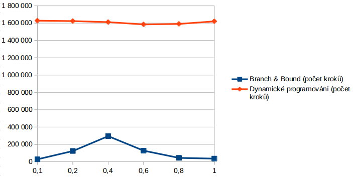

## MI-PAA: Experimentální hodnocení kvality algoritmů

### Specifikace úlohy
Viz [edux](https://edux.fit.cvut.cz/courses/MI-PAA/tutorials/batoh).

### Generátor instancí problému batohu

Popis programu viz [edux](https://edux.fit.cvut.cz/courses/MI-PAA/homeworks/knapsack/generator).

Parametry jsem nastavil ve výchozím nastavení takto:

- počet věcí: 18
- počet instancí: 50
- poměr kapacity batohu k sumární váze: 0,6
- max. váha věci: 100
- max. cena věci: 250 
- exponent k: 1
- rovnováha velikosti věcí: 0

Generátor jsem tedy zkompiloval a spustil takto:

```bash
$ gcc -o knapgen.o knapgen.c knapcore.c -lm
$ ./knapgen.o -n 18 -N 50 -m 0.6 -W 100 -C 250 -k 1 -d 0 > input.txt 
  2> output.txt
```

### Měření

V následujících měřeních je změněnen vždy jeden z parametrů výše.

#### Maximální váha

##### Tabulka

| Maximální váha | Branch & Bound (počet kroků) |	Dynamické progr. (počet kroků) | Heurestika (relativní chyba v %) 
|:--|:--|:--|:--|
| 25 |	188 278 |	1 647 934 |	0,14 
| 50 |	191 236 |	1 602 622 |	0,14 
| 75 |	204 334 |	1 616 894 |	0,18 
| 100 |	178 446 |	1 619 294 |	0,15 
| 250 |	172 692 |	1 647 742 |	0,16 
| 500 |	199 670 |	1 624 222 |	0,11 

##### Graf


##### Pozorování

Dle výsledků v tabulce můžeme soudit, že změna váhy věcí nemá vliv na dynamické programování, ani B&B algoritmus. Stejně tak relativní chyba heurestiky má podobné hodnoty.


#### Maximální cena

##### Tabulka

| Maximální cena | Branch & Bound (počet kroků) |	Dynamické progr. (počet kroků) | Heurestika (relativní chyba v %) |
|:--|:--|:--|:--|
| 25 | 199 828 | 159 934 | 0,15 |
| 50 | 209 086 | 331 838 | 0,16 |
| 75 | 190 250 | 486 046 | 0,16 |
| 100 | 195 266 | 641 870 | 0,13 |
| 250 | 188 454 | 1 628 350 | 0,14 |
| 500 | 197 988 | 3 179 262 | 0,14 |


##### Graf


##### Pozorování

Z grafu je jasně patrná závislost dynamického programování na ceně. To je dané tím, že kompozici děláme dle ceny, a tudíž s vyšší cenou přichází větší tabulka. U B&B a heurestiky nepozorujeme závislost.


#### Kapacita k sumární váze

##### Tabulka

| Kapacita k sumární váze | Branch & Bound (počet kroků) |	Dynamické progr. (počet kroků) | Heurestika (relativní chyba v %) |
|:--|:--|:--|:--|
| 0,1 | 3 130 926 | 1 627 966 | 0,28 |
| 0,2 | 2 622 180 | 1 623 422 | 0,22 |
| 0,4 | 954 228 | 1 611 358 | 0,15 |
| 0,6 | 215 736 | 1 584 942 | 0,16 |
| 0,8 | 49 410 | 1 590 702 | 0,12 |
| 1 | 33 982 | 1 620 478 | 0,00 |


##### Graf



##### Pozorování

Parametr určuje z kolika věcí se bude skládat finální řešení. Čím vyšší poměr, tim více položek bude v řešení.

Závislost u alg. B&B je evidentní. Čim více položek v řešení, tim méně různých kombinací musíme zkoumat. Nejvýrazněji to lze vidět u `m=1`, v tomto případě jsou všechny položky součástí řešení a my ho nalezneme velmi rychle.


#### Granularita (d = -1)

##### Tabulka

| Granularita (d = -1) | Branch & Bound (počet kroků) |	Dynamické progr. (počet kroků) | Heurestika (relativní chyba v %) |
|:--|:--|:--|:--|
| 0,1 | 187 308 | 1 627 966 | 0,11 |
| 0,2 | 194 748 | 1 641 630 | 0,15 |
| 0,4 | 175 496 | 1 517 998 | 0,15 |
| 0,6 | 184 464 | 1 565 774 | 0,15 |
| 0,8 | 161 140 | 1 594 062 | 0,14 |
| 1 | 176 118 | 1 603 022 | 0,17 |


##### Graf


##### Pozorování

Parametrem `d=-1` vyžadujeme více menších věcích. Více menších věcích by nahrávalo dynamickému programování, pokud bychom kompozici provedli podle kapacity. V našem případě jsme ji ale programovali podle ceny, přesto je možné zaznemanat mírné klesání náročnosti.

V případě B&B a relativní chyby neshledáváme tendenci.

#### Granularita (d = 1)

##### Tabulka

| Granularita (d = 1) | Branch & Bound (počet kroků) |	Dynamické progr. (počet kroků) | Heurestika (relativní chyba v %) |
|:--|:--|:--|:--|
| 0,1 | 222 978 | 1 607 454 | 0,17 |
| 0,2 | 196 958 | 1 625 086 | 0,17 |
| 0,4 | 203 438 | 1 696 862 | 0,15 |
| 0,6 | 244 204 | 1 648 878 | 0,15 |
| 0,8 | 212 750 | 1 614 206 | 0,14 |
| 1 | 265 048 | 1 610 174 | 0,16 |


##### Graf


##### Pozorování

Parametrem `d=1` vyžadujeme větší věci. Jedná se tedy o opak minulého případu. Opravdu se zdá, že dynamické programování má lehce rozstoucí tendenci, což je v souladu s minulým pozorováním.

B&B a heurestika nevykazuje závislost.

### Závěr

Provedli jsme experimentální hodnocení kvality algoritmů. Některé závislosti jsou zcela zřejmé, u některých bychom nejspíše museli provést více měření, abychom mohli vynést jasnější tvrzení.

Algoritmus hrubé síly jsme neměřeli neboť jeho nulová závislost na paremtrech výše je evidentní.


Autor: Tomáš Sušánka (susantom)

