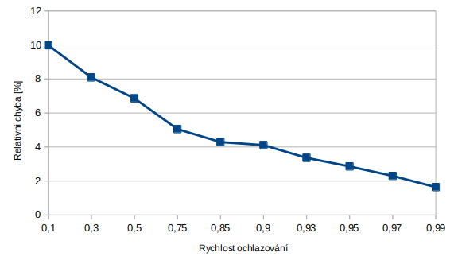
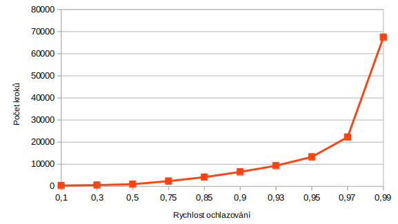
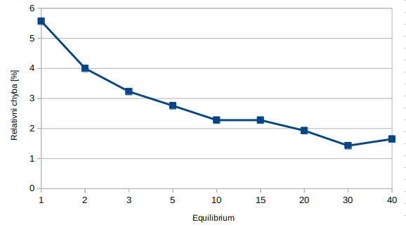
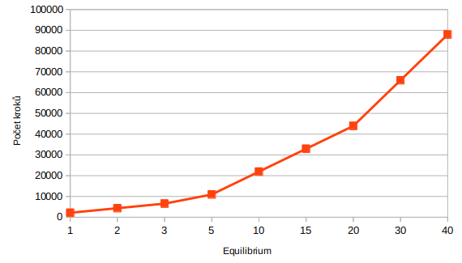
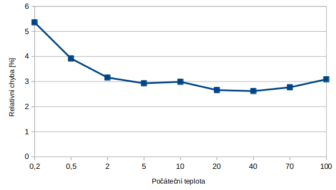
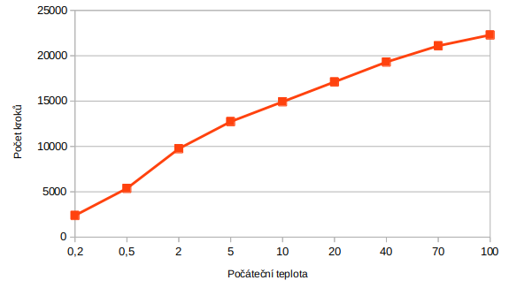

## MI-PAA: Seznámení se se zvolenou pokročilou iterativní metodou na problému batohu

### Specifikace úlohy
Viz [edux](https://edux.fit.cvut.cz/courses/MI-PAA/tutorials/batoh).

### Zadání
Viz [edux](https://edux.fit.cvut.cz/courses/MI-PAA/homeworks/04/start).

### Algoritmus

Algoritmus jsem zvolil simulované ochlazování (Simulated annealing).

Základní kostru algoritmu jsem vytvořil podle slidů 15 a 13 přednášky 8. Naprogramovat řešení bylo relativně jednoduché, opravdový oříšek je správné nastavení parametrů algoritmu.

### Měření

K měření jsem použil testovací data, která obsahují i řešení. Použil jsem soubory `knap_40.inst.dat` a `knap_40.sol.dat`, tedy zadání s 40 položkami. Program rovnou načte soubor s řešením a vyhodnotí relativní chybu. Jako další argumenty bere parametry simulovaného ochlazování v pořadí:

- míra ochlazování
- délka ekvilibria
- počáteční teplota
- koncová teplota

Výchozí nastavení jsem zvolil takto:

- míra ochlazování = 0.94
- délka ekvilibria = 5
- počáteční teplota = 3
- koncová teplota = 0.1

Toto nastavení jsem experimentálně vypozoroval. Vykazuje chybu kolem 3% a počet kroků kolem 10000. Při demonstraci vlivu ostatních parametrů jsem použil toto nastavení a měnil vždy pouze jeden daný parametr, analogicky jako u minulého úkolu.

Příklad spuštění programu:

`./main.php data/input/knap_40.inst.dat data/output/knap_40.sol.dat 0.94 5 3 0.1`

### Závislost na rychlosti ochlazování

Tabulka:

| ochlazování | chyba [%] | počet kroků |
|:----|:---------|:------------|
| 0.1 | 9.98 | 398 |
| 0.3 | 8.09 | 597 |
| 0.5 | 6.86 | 995 |
| 0.75 | 5.05 | 2388 |
| 0.85 | 4.29 | 4179 |
| 0.9 | 4.11 | 6567 |
| 0.93 | 3.36 | 9353 |
| 0.95 | 2.86 | 13333 |
| 0.97 | 2.30 | 22288 |
| 0.99 | 1.64 | 67461 |

Graf:

S rychlostí ochlazování klesá relativní chyba. Také je však nutné poznamenat, že exponenciálně roste počet kroků. Rozumná hodnota se zdá být kolem 0,93, kde se chybovost drží kolem 3% a zároveň je počet kroků uspokojitelný.

### Závislost na počtu iterací ekvilibria

Tabulka:

| Equilibrium | Chyba [%] | Počet kroků |
|:----|:---------|:------------|
| 1 | 5.57 | 2145 |
| 2 | 4.00 | 4345 |
| 3 | 3.23 | 6545 |
| 5 | 2.76 | 10945 |
| 10 | 2.28 | 21945 |
| 15 | 2.28 | 32945 |
| 20 | 1.93 | 43945 |
| 30 | 1.43 | 65945 |
| 40 | 1.65 | 87945 |

Graf:

Ekvilibrium udává počet stavů, které vyzkoušíme před ochlazením. Z grafu vidíme, že relativní chyba klesá a počet kroků se významně zvyšuje. Ideální hodnota se pohybuje kolem ekv=10.

### Závislost na počáteční teplotě

| Počáteční teplota | Chyba [%] | Počet kroků |
|:----|:---------|:------------|
| 0.2 | 5.36 | 2388 |
| 0.5 | 3.92 | 5373 |
| 2 | 3.16 | 9751 |
| 5 | 2.93 | 12736 |
| 10 | 2.99 | 14925 |
| 20 | 2.66 | 17114 |
| 40 | 2.62 | 19303 |
| 70 | 2.77 | 21094 |
| 100 | 3.09 | 22288 |

Graf:

Při příliš nizké počáteční teplotě je chybovost vysoká. Vysoká počáteční teplota přináší velký počet kroků.

### Závěr

Naprogramoval jsem pokročilou iterativní metodu, konkrétně simulované ochlazování. Předvedl jsem, jak parametry ovlivňují výsledné řešení a jeho náročnost.

Autor: Tomáš Sušánka (susantom)

