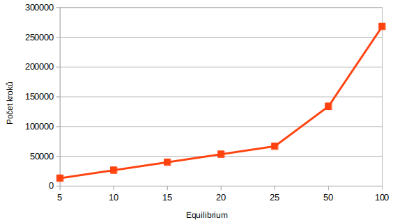

## MI-PAA: Řešení problému vážené splnitelnosti booleovské formule pokročilou iterativní metodou

### Specifikace úlohy
Viz [edux](https://edux.fit.cvut.cz/courses/MI-PAA/homeworks/05/start).

### Zadání
Viz [edux](https://edux.fit.cvut.cz/courses/MI-PAA/homeworks/05/start).

### Algoritmus

Jako v minulém úkolu jsem zvolil algoritmus simulované ochlazování (Simulated annealing).

Základní kostru algoritmu jsem vytvořil podle slidů 15 a 13 přednášky 8. Naprogramovat řešení bylo relativně jednoduché, těžší částí je správné nastavení parametrů algoritmu.

### Program

Program bere jako argumenty parametry simulovaného ochlazování v pořadí:

- číslo vzorce (viz dále)
- míra ochlazování
- délka ekvilibria
- počáteční teplota
- koncová teplota

### Zkušební instance

Zkušební instance jsem si vygeneroval pomocí nástroje, který jsem nalezl [zde](https://github.com/ziyuw/entropy_approx/blob/master/extra/G2.c), a který jsem lehce upravil. Generátor je bez řešení, to jsem dopočítal exaktní metodou a doplnil do souborů.

Nejdříve jsem vygeneroval instance o 15 proměnných a 50 klauzulí. Ty se však ukázaly jako přílíš malé a tak jsem vygeneroval další o velikosti 18 proměnných a 50 klauzulí, které mě již uspokojily. Pro úplnost však přikládám oboje.

### Parametry

Uvažoval jsem, jak ideálně zvolit počáteční teplotu a zdali bych neměl vzít v úvahu parametry instance. Vytvořil jsem tedy experiment, kde počáteční hodnotu počítám dle jednoho z následujících vzorců:

1. To = Tp
2. To = Tp * maxWeight
3. To = Tp * (maxWeight / n)
4. To = Tp * (maxWeight / m)

kde

- Tp .................. parametr počáteční teploty
- n .................... počet proměnných
- m ................... počet klauzulí
- maxWeight .... maximální váha

Konkrétní hodnoty jsem zvolil také ve 4 různých variací. V následující tabulce je výsledek tohoto snažení:

Připomeňme, že vzorec 1 je stanoven jako `To = Tp`, není zde tedy žádná závislost mezi daty a počáteční teplotu. Teplota je přímo rovna parametru teploty. Porovnejme výsledky ostatních vzorců s tímto.

Z tabulky je vidět, že vzorce mají minimální vliv na výsledné hodnoty. Tam kde vzroste počet kroků, klesne také chybovost. Nezjistili jsme však, že použití jakéhokoliv z vzorců vede obecně k lepším výsledkům. Zdá se, že buď vzorce nemají vliv, nebo jsou nastavené chybně, anebo testovací data nevykazují dostatečné odlišnosti.

Pojďme se tedy spíše věnovat správnému nastavení parametrů pro vzorec číslo 1.

### Nastavení

Následující dvě tabulky uvádí naměřené hodnoty:

Míru ochlazování a konečnou teplotu jsem již po několika experimentech stanovil na uvedené hodnoty, které se zdály vhodné. Proto se zde věnuji především manipulaci s ekvilibriem a počátečni teplotou, jejichž nastavení bylo méně triviální.

Nastavení č. 1, 2 a 7 můžeme vyloučit pro příliš vysokou chybovost. Nastavení č. 5 má podobné výsledky jako č. 4, které ho však dosáhne za méně kroků. Pokud považujeme za přijatelnou chybovost do 2%, nejvhodnější se zdá nastavení 4, 5 a 6. Číslo 4 má ke své nízké chybě také nizký počet kroků, tudíž v dalších měření pracuji s tímto nastavení.

### Měření

V jako minulém domacím úkolu dále uvadím závislost na jendotlivých parametrech. Jak již bylo zmíněno vycházím z nastavení č. 4:

- míra ochlazování = 0.94
- délka ekvilibria = 25
- počáteční teplota = 1000
- koncová teplota = 0.1

### Závislost na rychlosti ochlazování

Tabulka:

| ochlazování | chyba [%] | počet kroků |
|:----|:---------|:------------|
| 0.5 | 21.77 | 6286 |
| 0.75 | 8.66 | 14817 |
| 0.85 | 2.66 | 25593 |
| 0.9 | 3.65 | 39512 |
| 0.95 | 1.05 | 80820 |
| 0.97 | 0.86 | 136047 |
| 0.99 | 0.04 | 411733 |

Graf:

Z grafu lze vidět, že ideální rychlost ochlazování je pravděpodobně 0,95. Vykazuje se ještě nízkým počtem kroků a zároveň chybovostí do 2%. Vyšší rychlost ochlazování sice přináší nižší chybovost, ale již za cenu výrazně vyššího počtu kroků.

### Závislost na počtu iterací ekvilibria

Tabulka:

| Equilibrium | Chyba [%] | Počet kroků |
|:----|:---------|:------------|
| 5 | 10.35 | 13261 |
| 10 | 4.47 | 26671 |
| 15 | 3.05 | 40081 |
| 20 | 1.94 | 53491 |
| 25 | 0.65 | 66901 |
| 50 | 0.3 | 133951 |
| 100 | 0 | 268051 |

Graf:

Ekvilibrium udává počet stavů, které vyzkoušíme před ochlazením. Z grafu vidíme, že relativní chyba klesá a počet kroků se významně zvyšuje. Ideální hodnota se pohybuje kolem ekv=25.

### Závislost na počáteční teplotě

| Počáteční teplota | Chyba [%] | Počet kroků |
|:----|:---------|:------------|
| 5 | 3.37 | 28736 |
| 10 | 2.15 | 33675 |
| 20 | 2.62 | 38614 |
| 50 | 2.23 | 45349 |
| 100 | 1.29 | 50288 |
| 1000 | 1.24 | 66901 |
| 5000 | 0.94 | 78575 |

Graf:

Při příliš nizké počáteční teplotě je chybovost vysoká. Vysoká počáteční teplota přináší velký počet kroků a zároveň nepřínáší významné snížení chybovosti.

### Závěr

Naprogramoval jsem řešení problému vážené splnitelnosti booleovské formule. Jako pokročilou iterativní metodou jsem zvolil stejně jako v minulém případě simulované ochlazování (Simulated annealing).

Společně s minulou úlohou jsem se přesvědčil, že programování těchto metod není složité. Novou zkušeností je správné nastavení parametrů, a také že nový problém vyžaduje nové konkrétní nastavení.

Autor: Tomáš Sušánka (susantom)

