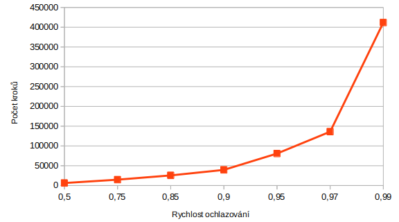
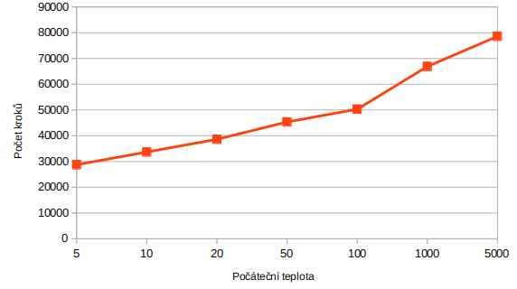

## MI-PAA: Řešení problému vážené splnitelnosti booleovské formule pokročilou iterativní metodou

### Specifikace úlohy
Viz [edux](https://edux.fit.cvut.cz/courses/MI-PAA/homeworks/05/start).

### Zadání
Viz [edux](https://edux.fit.cvut.cz/courses/MI-PAA/homeworks/05/start).

### Algoritmus

Jako v minulém úkolu jsem zvolil algoritmus simulované ochlazování (Simulated annealing).

Základní kostru algoritmu jsem vytvořil podle slidů 15 a 13 přednášky 8. Naprogramovat řešení bylo relativně jednoduché, opravdový oříšek je správné nastavení parametrů algoritmu.

### Zkušební instance

K měření jsem použil testovací data, které jsem získal !!!! TODO !!!!. Data obsahují vždy 20 proměnných a 91 klauzulých. V komentáři se také nacházá řešení. Pro ověření řešení uvedeného v testovacích datech jsem naprogramoval řešení úlohy hrubou silou, viz `SatSolverBrute`.

Program bere jako argumenty parametry simulovaného ochlazování v pořadí:

- míra ochlazování
- délka ekvilibria
- počáteční teplota
- koncová teplota

## Parametry

Pro zvolení ideální počáteční teploty jsem vzal v úvahu následující 4 metody výpočtu počáteční teploty:

- To = Tp
- To = Tp*maxWeight
- To = Tp*(maxWeight/n)
- To = Tp*(maxWeight/m)

kde

- Tp ........... parametr počáteční teploty
- n ............ počet proměnných
- m ............ počet klauzulí
- maxWeight .... maximální váha

Konkrétní hodnoty jsem zvolil také ve 4 různých variací. K číslům jsem také došel experimentálně. Zde dokumentuji 4 nastavení:

1)
- rychlost ochlazování = 0.94
- equilibrium = 100
- počáteční teplota = 100
- temp end = 0.1

2)
- rychlost ochlazování = 0.94
- equilibrium = 100
- počáteční teplota = 100
- temp end = 0.1

3)
- rychlost ochlazování = 0.94
- equilibrium = 100
- počáteční teplota = 100
- temp end = 0.1

4)
- rychlost ochlazování = 0.94
- equilibrium = 100
- počáteční teplota = 100
- temp end = 0.1

Následuje experimentální zjištění, které z těchto metod a natavení je nejlepší.

### Měření

#### Metoda 1

**To = Tp**

### Závislost na rychlosti ochlazování

Tabulka:

| ochlazování | chyba [%] | počet kroků |
|:----|:---------|:------------|
| 0.1 | 9.98 | 398 |
| 0.3 | 8.09 | 597 |
| 0.5 | 6.86 | 995 |
| 0.75 | 5.05 | 2388 |
| 0.85 | 4.29 | 4179 |
| 0.9 | 4.11 | 6567 |
| 0.93 | 3.36 | 9353 |
| 0.95 | 2.86 | 13333 |
| 0.97 | 2.30 | 22288 |
| 0.99 | 1.64 | 67461 |

Graf:

S rychlostí ochlazování klesá relativní chyba. Také je však nutné poznamenat, že exponenciálně roste počet kroků. Rozumná hodnota se zdá být kolem 0,93, kde se chybovost drží kolem 3% a zároveň je počet kroků uspokojitelný.

### Závislost na počtu iterací ekvilibria

Tabulka:

| Equilibrium | Chyba [%] | Počet kroků |
|:----|:---------|:------------|
| 1 | 5.57 | 2145 |
| 2 | 4.00 | 4345 |
| 3 | 3.23 | 6545 |
| 5 | 2.76 | 10945 |
| 10 | 2.28 | 21945 |
| 15 | 2.28 | 32945 |
| 20 | 1.93 | 43945 |
| 30 | 1.43 | 65945 |
| 40 | 1.65 | 87945 |

Graf:

Ekvilibrium udává počet stavů, které vyzkoušíme před ochlazením. Z grafu vidíme, že relativní chyba klesá a počet kroků se významně zvyšuje. Ideální hodnota se pohybuje kolem ekv=10.

### Závislost na počáteční teplotě

| Počáteční teplota | Chyba [%] | Počet kroků |
|:----|:---------|:------------|
| 0.2 | 5.36 | 2388 |
| 0.5 | 3.92 | 5373 |
| 2 | 3.16 | 9751 |
| 5 | 2.93 | 12736 |
| 10 | 2.99 | 14925 |
| 20 | 2.66 | 17114 |
| 40 | 2.62 | 19303 |
| 70 | 2.77 | 21094 |
| 100 | 3.09 | 22288 |

Graf:

Při příliš nizké počáteční teplotě je chybovost vysoká. Vysoká počáteční teplota přináší velký počet kroků.

### Závěr

Naprogramoval jsem pokročilou iterativní metodu, konkrétně simulované ochlazování. Předvedl jsem, jak parametry ovlivňují výsledné řešení a jeho náročnost.

Autor: Tomáš Sušánka (susantom)

