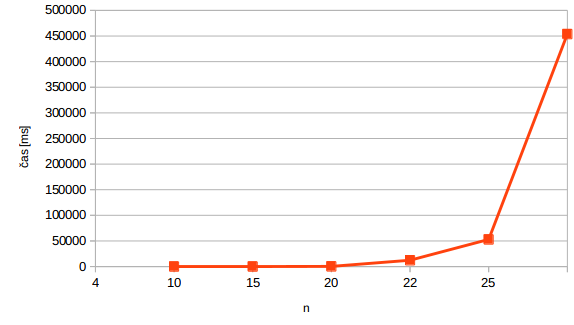
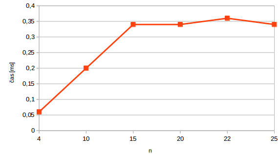
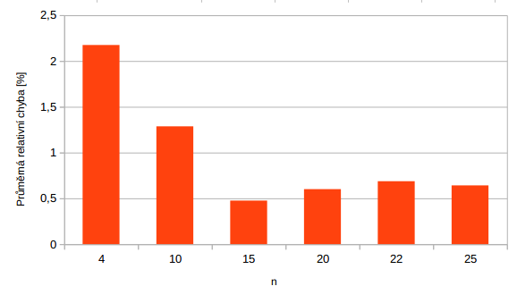
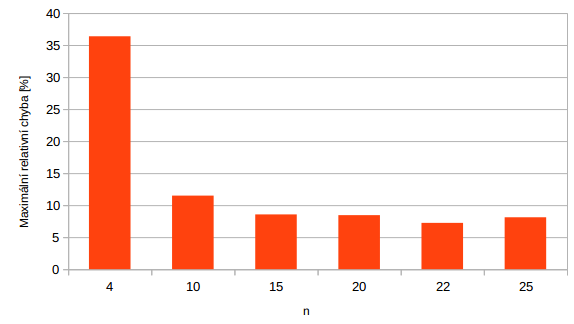

## MI-PAA: Řešení problému batohu metodou hrubé síly a jednoduchou heuristikou

### Specifikace úlohy
Viz [edux](https://edux.fit.cvut.cz/courses/MI-PAA/tutorials/batoh).

### Rozbor možných variant řešení

##### Řešení hrubou silou

Procházíme všechny možnosti. Máme zaručeno, že nalezneme optimální řešení. Složitost je O(2^n).

##### Řešení heuristikou poměr cena/váha

Nejprve si pro každou položku spočítáme poměr cena/váha. Poté setřídíme. Do batohu poté přidáváme položky, které mají nejlepší poměr. Složitost je O(nlogn), avšak algoritmus nezaručuje nalezení optimálního řešení.

### Popis kostry algoritmu

Soubor `main.php` obsahuje prvotní logiku programu. Načte data ze souboru a řádek po řádku vytváří instanci třídy `RuckSackProblemBrute` (příp. `RuckSackProblemRatio`). Tyto třídy jsou potomky abstraktní třídy `BaseRuckSackProblem`, která má pomocné metody pro zpracování vstupu a výstupu. Také definuje abstraktní metodu `solve()`, která je zodpovědná za spočtení řešení.

`RuckSackProblemBrute` vytváří rekurzi o *n* větvích. V každé části provadíme jendo rekurzivní volání pro hodnotu TRUE a jedno pro FALSE. Tímto způsobem vygenerujeme všechny možné varianty. Pro každou tuto variantu voláme funkci `check()`, která spočítá váhu a cenu daného řešení. Pokud je váha validní (nepřesahuje hmotnost baťohu) a pokud je cena nejvyšší nalezená, uložíme tuto konfiguraci. Na závěr řešení vypíšeme.

`RuckSackProblemRatio` si nejdříve spočte poměr cena/váha ke každé položce. Poté tyto poměry seřadí. Následně se volá funkce `add()`, která  podle seřazených hodnot postupně přidává položky do batohu.

### Naměřené výsledky

#### Hrubá síla

Nameřené časy v ms za běh jedné instance problému v závislosti na *n*.

Tabulka:

|  n  |    čas [ms] |
|:----|:------------|
|  4  |  0,4    |
| 10  |  8,34   |
| 15  |  336,2    |
| 20  |  12357,0    |
| 22  |  52981,52  |
| 25  |  453796,22 |

Graf:

n

#### Heuresitika cena/výkon

Tabulka:

|  n  |    čas [ms] |
|:----|:------------|
|  4  |  0,06   |
| 10  |  0,2   |
| 15  |  0,34   |
| 20  |  0,34   |
| 22  |  0,36  |
| 25  |  0,34 |

Graf:

##### Relativní chyba

Průměrná relativní chyba:

|  n  |  průměrná rel. chyba [%] |
|:----|:------------|
| 4 | 2,17 |
| 10 | 1,29 |
| 15 | 0,48 |
| 20 | 0,60 |
| 22 | 0,69 |
| 25 | 0,64 |

Maximální relativní chyba:

|  n  |  maximální rel. chyba [%] |
|:----|:------------|
| 4 | 36,36 |
| 10 | 11,48 |
| 15 | 8,54 |
| 20 | 8,43 |
| 22 | 7,23 |
| 25 | 8,10 |

Měřeno na:

- PHP 5.6.14
- Linux 3.18.22 Manjaro distribution based on Arch Linux
- Intel(R) Core(TM) i7-3517U CPU @ 1.90GHz
- 4 GB RAM

### Závěr

Vidíme, že naměřené časy u metody hrubou silou opravdu rostou exponenciálně. Rozdíl mezi časy hrubou silou a metodou cena/váha je s roustoucím *n* obrovský. Průměrná relativní chyba u vyšších *n* padá pod 1%. Pokud nám tedy tato chybovost nevadí, heurestika nabízí rychlé řešení problému.

Autor: Tomáš Sušánka (susantom)

